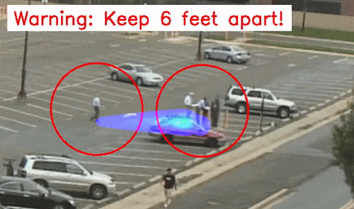

# Social Distancing Violation Prediction

Out-of-the-box code base for social distancing violation prediction. Given a video, this code will give out a warning if the system predicts that people will violate social distancing (getting closer with each other than 6 feet) in the next 5 seconds. This early warnings could help stop people before they are actually at risk of getting infected. See this [blog](https://medium.com/@junweil/social-distancing-early-forecasting-system-60186baa67f5).

Keep social distancing (about 6 feet) and [save lives](https://www.cdc.gov/)!

Below we show an example of the system output. If potential risks are detected, trajectory predictions are shown and warnings are printed near the person.

<div align="center">
  <div style="">
      
  </div>
  <br/>
</div>


## Dependencies
+ Python 2/3; TensorFlow==1.15.2; cv2; tqdm; scipy; sklearn; matplotlib; ffmpeg

## Usage
### Step 1: Download models and a test video
Assuming you run the code at the top level of this repository. Model size is about 468MB and the test video is about 7MB.
```
bash scripts/download_models.sh
bash scripts/download_test_video.sh
```

### Step 2: Run inferencing
```
python code/inference/main.py test/test_videos.lst test/output --pred_vis_path test/visualization
```

### Step 3: Make a video
```
cd test/visualization
ffmpeg -framerate 30.0 -i test_video/test_video_F_%08d.jpg test_video.mp4
```

## Speed
My limited tests show that on a RTX 2060 the processing time is 5x real-time, which means a one-minute 1920x1080 video will take 5 minute to process. And about 3 minutes of the processing is for visualization (writing tons of images to the disk). On a GTX 1080 TI it is 4x real-time.

## Acknowledgments
This project is based on [Next-Prediction](https://github.com/google/next-prediction) and [CMU's Object Detection and Tracking](https://github.com/JunweiLiang/Object_Detection_Tracking).
If you find this code useful then please cite:
```
@inproceedings{liang2019peeking,
  title={Peeking into the future: Predicting future person activities and locations in videos},
  author={Liang, Junwei and Jiang, Lu and Niebles, Juan Carlos and Hauptmann, Alexander G and Fei-Fei, Li},
  booktitle={Proceedings of the IEEE Conference on Computer Vision and Pattern Recognition},
  pages={5725--5734},
  year={2019}
}
@inproceedings{liang2020garden,
  title={The Garden of Forking Paths: Towards Multi-Future Trajectory Prediction},
  author={Junwei Liang and Lu Jiang and Kevin Murphy and Ting Yu and Alexander Hauptmann},
  booktitle={Proceedings of the IEEE Conference on Computer Vision and Pattern Recognition},
  year={2020}
}
```

## More Examples
<div align="center">
  <div style="">
      
  </div>
  <br/>
  <div style="">
      
  </div>
  <br/>
  <div style="">
      
  </div>
</div>

